# Flow Chat High-Level Architecture

This diagram visualizes the complete data flow of the Flow Chat application, highlighting the Hybrid AI Verification system and the Dual-Database architecture for high-performance matchmaking and persistent safety enforcement.

```mermaid
%%{init: {'theme': 'base', 'themeVariables': { 'primaryColor': '#3b82f6', 'primaryTextColor': '#fff', 'primaryBorderColor': '#1e40af', 'lineColor': '#64748b', 'secondaryColor': '#bbf', 'tertiaryColor': '#fff' }}}%%
flowchart TD
    %% Define Nodes
    subgraph Client ["🖥️ Client Integration (Browser)"]
        direction TB
        UI["⚛️ React Frontend (Vite)"]
        Cam["📷 Webcam Input"]
        FaceAPI["🛡️ Fallback AI (Face-API.js)"]
        SocketC["🔌 Socket.IO Client"]
    end

    subgraph Backend ["☁️ Backend Infrastructure"]
        direction TB
        NodeServer["🟢 Node.js Server (Express)"]
        SocketS["🔌 Socket.IO Server"]
        
        subgraph Logic ["Business Logic"]
            MatchService["⚡ Matchmaking Service"]
            BanSystem["🚫 Ban Enforcement System"]
        end
    end

    subgraph AI_Service ["🧠 Primary AI Microservice"]
        direction TB
        PyAPI["🐍 Python FastAPI"]
        ViT["👁️ Vision Transformer (HuggingFace)"]
    end

    subgraph Data ["💾 Data Persistence"]
        direction TB
        Redis[("⚡ Redis (Cache & Queues)")]
        Mongo[("🍃 MongoDB (User Reputation)")]
    end

    %% Client Flows
    Cam -->|"Capture Frame"| UI
    UI -->|"1. Hybrid Verify"| PyAPI
    PyAPI -->|"2. Inference"| ViT
    ViT -->|"3. Gender Result"| PyAPI
    PyAPI -.->|"200 OK"| UI
    PyAPI -.->|"500/Timeout"| FaceAPI
    FaceAPI -->|"Fallback Result"| UI

    %% Real-time Connection
    UI -->|"WebSocket Handshake"| SocketC
    SocketC <==>|"Events: join, message, report"| SocketS
    SocketS --> NodeServer

    %% Backend Flows
    NodeServer --> MatchService
    NodeServer --> BanSystem

    %% Matchmaking Logic
    MatchService -->|"1. Enqueue / Dequeue"| Redis
    MatchService -->|"2. Check Daily Limit"| Redis
    Redis -->|"3. Match Pair"| MatchService

    %% Ban & Safety Logic
    BanSystem -->|"1. Check Ban Status"| Mongo
    BanSystem -->|"2. Sync Reports"| Mongo
    BanSystem -->|"3. Cache Active Match"| Redis

    %% Styling
    classDef client fill:#e0f2fe,stroke:#0284c7,stroke-width:2px,color:#000
    classDef backend fill:#dcfce7,stroke:#16a34a,stroke-width:2px,color:#000
    classDef ai fill:#f3e8ff,stroke:#9333ea,stroke-width:2px,color:#000
    classDef data fill:#ffedd5,stroke:#ea580c,stroke-width:2px,color:#000

    class Client,UI,Cam,FaceAPI,SocketC client
    class Backend,NodeServer,SocketS,Logic,MatchService,BanSystem backend
    class AI_Service,PyAPI,ViT ai
    class Data,Redis,Mongo data
```

## Architecture Highlights

### 1. Hybrid AI Verification 🛡️
To ensure **100% Availability**, the system uses a tiered approach:
*   **Tier 1 (Primary)**: Images are sent to the Python FastAPI microservice where a heavy-weight **Vision Transformer** provides high-accuracy gender classification.
*   **Tier 2 (Fallback)**: If the backend times out (>5s) or errors, the Frontend immediately switches to **Face-API.js** running in the browser. This ensures users are never blocked by server load.

### 2. High-Performance Matchmaking ⚡
*   **Redis** is used as the primary engine for matchmaking queues. It handles atomic operations to pair users instantly without race conditions.
*   **TTL Keys**: Match history is stored in Redis with an expiration time to support "Hit-and-Run" reporting without clogging the database permanently.
*   **Rate Limiting**: Daily gender-filter limits are enforced via Redis counters, refreshed every 24 hours.

### 3. Persistent Safety & Reputation 🍃
*   **MongoDB** acts as the source of truth for user reputation.
*   It stores the **Report Count** and **Ban Expiry Timestamp**.
*   The "Fresh Start" logic in the backend automatically clears a user's report history once their ban time has served, ensuring fair treatment.
