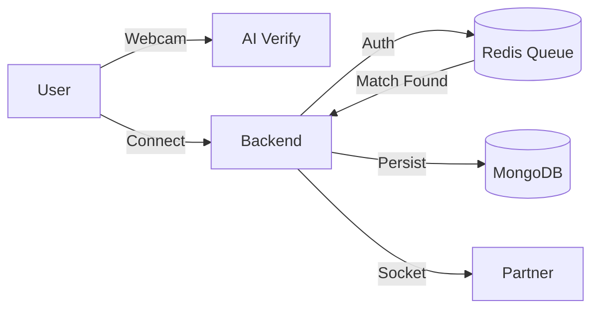

# 🦅 FlowChat (Klymo)
> **Controlled Anonymity, Intelligent Matching, and True Privacy.**

**FlowChat** is a privacy-first web application designed to solve the "Chat Roulette" problem. It balances anonymity with safety using AI verification, intent-based matching, and device fingerprinting—without requiring any personal information (PII).

---

## 🚀 Key Features

### 1. 🛡️ User Privacy & Safety
*   **No PII Required**: No email, phone number, or social login.
*   **Device Fingerprinting**: Identity is tied to a browser's unique signature (`crypto.randomUUID`), enforcing "Controlled Anonymity".
*   **Ban System**: Users receiving **>10 reports** are automatically banned for **24 hours**.

### 2. 🤖 Hybrid AI Gender Verification
*   **Primary Strategy**: Deep Learning via Python FastAPI (`rizvandwiki/gender-classification` model).
*   **Fallback Strategy**: Client-side Computer Vision (`face-api.js`) if the Python server is unreachable.
*   **Zero Retention**: Images are processed in RAM and **deleted immediately** after verification. No photos are ever stored in a database.

### 3. 🎯 Intent-Based Matchmaking
*   **Reciprocal Matching**: Solves the "Mismatched Intent" problem. male
    *   *Male seeking Female* will ONLY match with *Female seeking Male* (or Any).
*   **Instant Queue**: Powered by **Redis Sorted Sets** for O(1) matching speed.
*   **Fairness Limits**: Freemium model limits specific gender filters (**5 matches/day**) while keeping "Any" matches unlimited.

### 4. 💬 Ephemeral Chat (Socket.io)
*   **No Chat History**: Messages are relayed in-memory and cleared from the client upon disconnection.
*   **Graceful Exit**: If a partner leaves, the UI handles it instantly (5s countdown intro "Next Match").
*   **Real Identities**: Once matched, profiles (Nickname + Bio) are revealed to humanize the anonymous interaction.

---

## 🛠️ Tech Stack & Architecture

| Component | Technology | Role | Port |
| :--- | :--- | :--- | :--- |
| **Frontend** | React (Vite) + TypeScript | UI, Camera, Socket Client | `3000` |
| **Backend** | Node.js (Express) | Socket.IO Server, Business Logic | `5000` |
| **AI Service** | Python (FastAPI) | Gender Classification Model | `8000` |
| **Database** | MongoDB | User persistence (Reports, Bans) | `27017` |
| **Cache** | Redis | Instant Queues & Rate Limits | `6379` |

### System Flow


---

## ⚡ Quick Start

### Prerequisites
*   Node.js (v18+)
*   Python (v3.10+)
*   Redis (Running on 6379)
*   MongoDB (Running on 27017)

### 1. Start AI Service (Python)
```bash
cd Fastapi
pip install -r requirements.txt
python main.py
# Runs on Port 8000
```

### 2. Start Backend (Node.js)
```bash
cd Backend
npm install
# Linux/Mac
PORT=5000 npm run dev
# Windows (Powershell)
$env:PORT=5000; npm run dev
```

### 3. Start Frontend (React)
```bash
cd Frontend
npm install
npm run dev
# Runs on http://localhost:3000
```

---

## 🧪 Testing The App
1.  **Onboarding**: Open `http://localhost:3000`. Allow camera access.
2.  **Profile**: After AI verification, set a Nickname (e.g., "SkyWalker"). 
      **(Note:Please wait until Fastapi get's active it takes 10 seconds time else Verification will Fail)**
3.  **Dashboard**: You will see "Find Female", "Find Male", "Find Any" buttons.
4.  **Match**: Click "Find Any". Open a **second tab** (Incognito) and do the same to match with yourself.
5.  **Ban Test**: In the chat, click the **Red X** to report. After 10 reports, the user gets banned.


